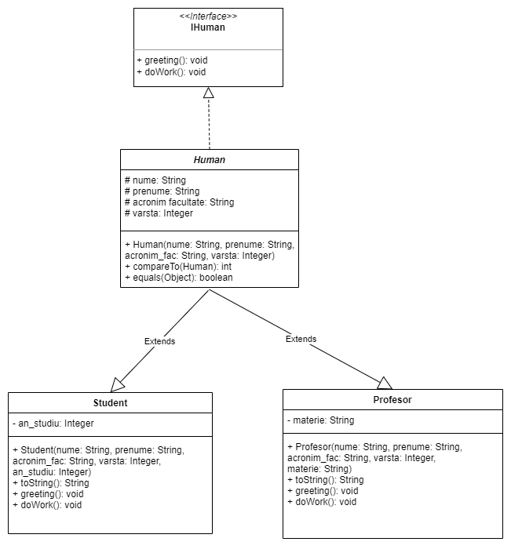
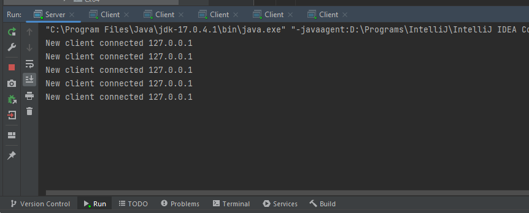
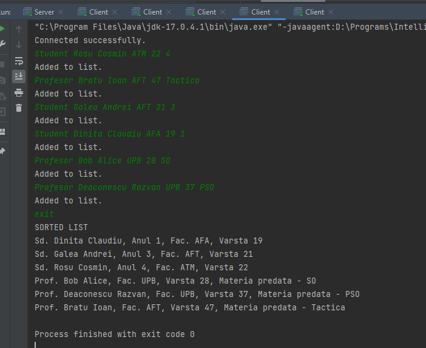
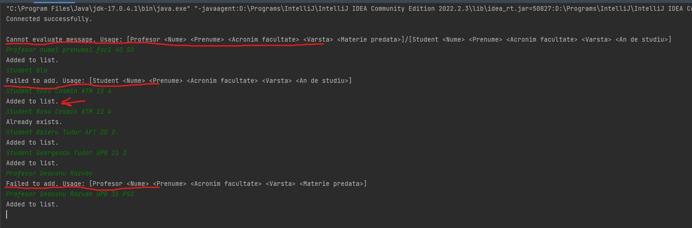
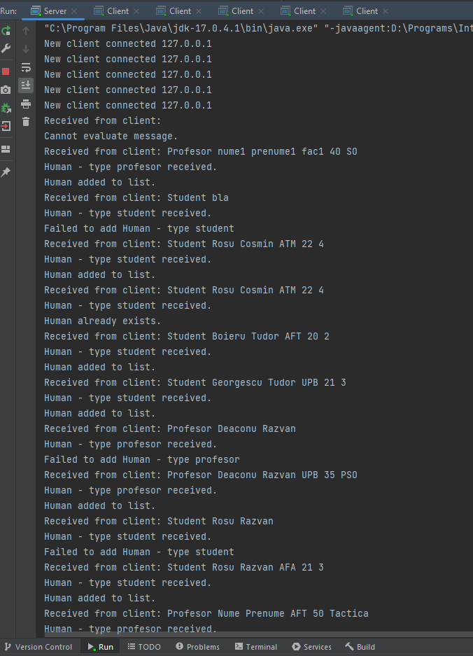

# Tema Java

## Descriere
Aplicatie client-server, multiclient ce va trata fiecare conexiune pe cate un thread separat si va stoca o lista cu persoane, pe baza datelor trimise de catre client. 
Threadul va crea o entitate pentru fiecare mesaj cu tipul corespunzator si le va stoca intr-o lista. La final, serverul va sorta lista pe baza varstei persoanelor si va afisa in consola rezultatul

## Diagrame clase utilizate

### Interfata IHuman
 - contine metodele "greeting()" si "doWork()"
 
### Clasa Abstracta Human
 - contine atributele comune claselor Student si Profesor
 - implementeaza interfata IHuman, fara a implementa metodele greeting si doWork
 - implementeaza interfata Comparable (va face comparatia intre 2 instante ale clasei Human pe baza varstei)
 - contine metoda de verificare a egalitatii intre 2 instante de tip Human (a fost suprascrisa metoda equals)

### Clasele Student si Profesor 
 - mostenesc clasa abstracta Human
 - au anumiti membri cat si metode comune, de aceea s-a implementat o clasa intermediara abstracta si nu am implementat direct interfata
 - clasa Student se identifica prin atributul suplimentar "an de studiu"
 - clasa Profesor are suplimentar atributul "materie"
 - au fost implementate metodele din interfata, avand implementari diferite

### Clasa Client
 - stabileste o conexiune cu serverul, realizata prin socketi
 - trimite inputul utilizatorului catre server
 
### Clasa Server
 - creeaza conexiuni cu clienti prin intermediul socketilor
 - porneste threaduri pentru a trata fiecare client in parte
 
### Clasa MyThread (in diagrama Client Handler)
 - primeste date de la utilizator
 - evalueaza inputul primit 
 - creeaza instante ale claselor Student si Profesor
 - retine o lista cu entitatile create

## Multiclient
Prin tratarea fiecarei conexiuni pe cate un thread individual, pot exista mai multe instante in acelasi timp
  

## Demo
După realizarea conexiunii, clientul va trimite mesaje de forma Tip Valoare_Camp
Ex. Student Dorobantu Gabriel ATM 22 4
  

## Error handling
Dupa primirea datelor de la client, serverul va evalua daca datele primite au forma asteptata
  - Daca datele primite sunt conform asteptarilor, se va crea entitatea respectiva si va fi adaugata in lista
  - Daca ceva nu este in regula, va renunta la executarea actiunii
 Finalitatea actiunilor serverului este: acesta va semnala clientul cu rezultatul actiunii (added, already exists, failed, usage, ...)
  

## Server log
Fiecare actiune trebuie jurnalizata la nivelul serverului
Sunt afisate rezultatele acestora la consola
  

